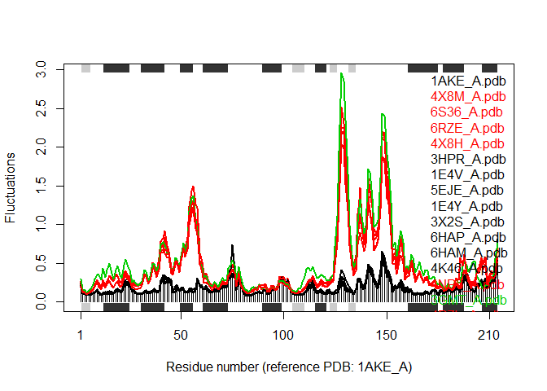

Structural Bioinformatics (pt. 1)
================

\#\#PDB Statistics

Download a CSV file from the PDB site (accessible from “Analyze” \> “PDB
Statistics” \> “by Experimental Method and Molecular Type”. Move this
CSV file into your RStudio project and use it to answer the following
questions:

Q: What percentage of structures in the PDB are solved by X-Ray and
Electron Microscopy.

Q: What proportion of structures in the PDB are protein?

Q: Type HIV in the PDB website search box on the home page and determine
how many HIV-1 protease structures are in the current PDB?

``` r
PDB_Stats<-read.csv("Data Export Summary.csv", row.names = 1)
total_structures<-sum(PDB_Stats[,"Total"])
print(total_structures)
```

    ## [1] 160464

``` r
Q1<-round(100*PDB_Stats["X-Ray","Total"]/total_structures,2)
print(Q1)
```

    ## [1] 88.95

``` r
Q2<-round(100*sum(PDB_Stats[,"Proteins"])/total_structures,2)
print(Q2)
```

    ## [1] 92.69

``` r
Q3<-round(100*141/total_structures,2)
```

Second chunk of Q’s Q: How many amino acid residues are there in this
pdb object?

Q: Name one of the two non-protein residues?

Q: How many protein chains are in this structure?

``` r
library(bio3d)
PDB_1hsg<- read.pdb("1hsg")
```

    ##   Note: Accessing on-line PDB file

## Based on PDB output, 198 Residues (Q1), HOH and MK1 are non-protein residues (Q2), and there are 2 chains (Q3)

``` r
attributes(PDB_Stats)
```

    ## $names
    ## [1] "Proteins"           "Nucleic.Acids"      "Protein.NA.Complex"
    ## [4] "Other"              "Total"             
    ## 
    ## $class
    ## [1] "data.frame"
    ## 
    ## $row.names
    ## [1] "X-Ray"               "NMR"                 "Electron Microscopy"
    ## [4] "Other"               "Multi Method"

``` r
head(PDB_Stats$atom)
```

    ## NULL

``` r
library(bio3d)
aa <- get.seq("1ake_A")
```

    ## Warning in get.seq("1ake_A"): Removing existing file: seqs.fasta

    ## Fetching... Please wait. Done.

``` r
aa
```

    ##              1        .         .         .         .         .         60 
    ## pdb|1AKE|A   MRIILLGAPGAGKGTQAQFIMEKYGIPQISTGDMLRAAVKSGSELGKQAKDIMDAGKLVT
    ##              1        .         .         .         .         .         60 
    ## 
    ##             61        .         .         .         .         .         120 
    ## pdb|1AKE|A   DELVIALVKERIAQEDCRNGFLLDGFPRTIPQADAMKEAGINVDYVLEFDVPDELIVDRI
    ##             61        .         .         .         .         .         120 
    ## 
    ##            121        .         .         .         .         .         180 
    ## pdb|1AKE|A   VGRRVHAPSGRVYHVKFNPPKVEGKDDVTGEELTTRKDDQEETVRKRLVEYHQMTAPLIG
    ##            121        .         .         .         .         .         180 
    ## 
    ##            181        .         .         .   214 
    ## pdb|1AKE|A   YYSKEAEAGNTKYAKVDGTKPVAEVRADLEKILG
    ##            181        .         .         .   214 
    ## 
    ## Call:
    ##   read.fasta(file = outfile)
    ## 
    ## Class:
    ##   fasta
    ## 
    ## Alignment dimensions:
    ##   1 sequence rows; 214 position columns (214 non-gap, 0 gap) 
    ## 
    ## + attr: id, ali, call

``` r
##Q1 How many amino acids = 214
```

``` r
# Blast or hmmer search 
b <- blast.pdb(aa)
```

    ##  Searching ... please wait (updates every 5 seconds) RID = 4ECUHFEB014 
    ##  .
    ##  Reporting 99 hits

``` r
# Plot a summary of search results
hits <- plot(b)
```

    ##   * Possible cutoff values:    197 -3 
    ##             Yielding Nhits:    16 99 
    ## 
    ##   * Chosen cutoff value of:    197 
    ##             Yielding Nhits:    16

<!-- -->

``` r
# List out some 'top hits'
head(hits$pdb.id)
```

    ## [1] "1AKE_A" "4X8M_A" "6S36_A" "6RZE_A" "4X8H_A" "3HPR_A"

``` r
##list as described on the site
hits
```

    ## $hits
    ##    pdb.id   acc      group
    ## 1  "1AKE_A" "1AKE_A" "1"  
    ## 2  "4X8M_A" "4X8M_A" "1"  
    ## 3  "6S36_A" "6S36_A" "1"  
    ## 4  "6RZE_A" "6RZE_A" "1"  
    ## 5  "4X8H_A" "4X8H_A" "1"  
    ## 6  "3HPR_A" "3HPR_A" "1"  
    ## 7  "1E4V_A" "1E4V_A" "1"  
    ## 8  "5EJE_A" "5EJE_A" "1"  
    ## 9  "1E4Y_A" "1E4Y_A" "1"  
    ## 10 "3X2S_A" "3X2S_A" "1"  
    ## 11 "6HAP_A" "6HAP_A" "1"  
    ## 12 "6HAM_A" "6HAM_A" "1"  
    ## 13 "4K46_A" "4K46_A" "1"  
    ## 14 "4NP6_A" "4NP6_A" "1"  
    ## 15 "3GMT_A" "3GMT_A" "1"  
    ## 16 "4PZL_A" "4PZL_A" "1"  
    ## 
    ## $pdb.id
    ##  [1] "1AKE_A" "4X8M_A" "6S36_A" "6RZE_A" "4X8H_A" "3HPR_A" "1E4V_A" "5EJE_A"
    ##  [9] "1E4Y_A" "3X2S_A" "6HAP_A" "6HAM_A" "4K46_A" "4NP6_A" "3GMT_A" "4PZL_A"
    ## 
    ## $acc
    ##  [1] "1AKE_A" "4X8M_A" "6S36_A" "6RZE_A" "4X8H_A" "3HPR_A" "1E4V_A" "5EJE_A"
    ##  [9] "1E4Y_A" "3X2S_A" "6HAP_A" "6HAM_A" "4K46_A" "4NP6_A" "3GMT_A" "4PZL_A"
    ## 
    ## $inds
    ##  [1]  TRUE  TRUE  TRUE  TRUE  TRUE  TRUE  TRUE  TRUE  TRUE  TRUE  TRUE  TRUE
    ## [13]  TRUE  TRUE  TRUE  TRUE FALSE FALSE FALSE FALSE FALSE FALSE FALSE FALSE
    ## [25] FALSE FALSE FALSE FALSE FALSE FALSE FALSE FALSE FALSE FALSE FALSE FALSE
    ## [37] FALSE FALSE FALSE FALSE FALSE FALSE FALSE FALSE FALSE FALSE FALSE FALSE
    ## [49] FALSE FALSE FALSE FALSE FALSE FALSE FALSE FALSE FALSE FALSE FALSE FALSE
    ## [61] FALSE FALSE FALSE FALSE FALSE FALSE FALSE FALSE FALSE FALSE FALSE FALSE
    ## [73] FALSE FALSE FALSE FALSE FALSE FALSE FALSE FALSE FALSE FALSE FALSE FALSE
    ## [85] FALSE FALSE FALSE FALSE FALSE FALSE FALSE FALSE FALSE FALSE FALSE FALSE
    ## [97] FALSE FALSE FALSE
    ## 
    ## attr(,"class")
    ## [1] "blast"

``` r
# Download releated PDB files
files <- get.pdb(hits$pdb.id, path="pdbs", split=TRUE, gzip=TRUE)
```

    ## Warning in get.pdb(hits$pdb.id, path = "pdbs", split = TRUE, gzip = TRUE): pdbs/
    ## 1AKE.pdb exists. Skipping download

    ## Warning in get.pdb(hits$pdb.id, path = "pdbs", split = TRUE, gzip = TRUE): pdbs/
    ## 4X8M.pdb exists. Skipping download

    ## Warning in get.pdb(hits$pdb.id, path = "pdbs", split = TRUE, gzip = TRUE): pdbs/
    ## 6S36.pdb exists. Skipping download

    ## Warning in get.pdb(hits$pdb.id, path = "pdbs", split = TRUE, gzip = TRUE): pdbs/
    ## 6RZE.pdb exists. Skipping download

    ## Warning in get.pdb(hits$pdb.id, path = "pdbs", split = TRUE, gzip = TRUE): pdbs/
    ## 4X8H.pdb exists. Skipping download

    ## Warning in get.pdb(hits$pdb.id, path = "pdbs", split = TRUE, gzip = TRUE): pdbs/
    ## 3HPR.pdb exists. Skipping download

    ## Warning in get.pdb(hits$pdb.id, path = "pdbs", split = TRUE, gzip = TRUE): pdbs/
    ## 1E4V.pdb exists. Skipping download

    ## Warning in get.pdb(hits$pdb.id, path = "pdbs", split = TRUE, gzip = TRUE): pdbs/
    ## 5EJE.pdb exists. Skipping download

    ## Warning in get.pdb(hits$pdb.id, path = "pdbs", split = TRUE, gzip = TRUE): pdbs/
    ## 1E4Y.pdb exists. Skipping download

    ## Warning in get.pdb(hits$pdb.id, path = "pdbs", split = TRUE, gzip = TRUE): pdbs/
    ## 3X2S.pdb exists. Skipping download

    ## Warning in get.pdb(hits$pdb.id, path = "pdbs", split = TRUE, gzip = TRUE): pdbs/
    ## 6HAP.pdb exists. Skipping download

    ## Warning in get.pdb(hits$pdb.id, path = "pdbs", split = TRUE, gzip = TRUE): pdbs/
    ## 6HAM.pdb exists. Skipping download

    ## Warning in get.pdb(hits$pdb.id, path = "pdbs", split = TRUE, gzip = TRUE): pdbs/
    ## 4K46.pdb exists. Skipping download

    ## Warning in get.pdb(hits$pdb.id, path = "pdbs", split = TRUE, gzip = TRUE): pdbs/
    ## 4NP6.pdb exists. Skipping download

    ## Warning in get.pdb(hits$pdb.id, path = "pdbs", split = TRUE, gzip = TRUE): pdbs/
    ## 3GMT.pdb exists. Skipping download

    ## Warning in get.pdb(hits$pdb.id, path = "pdbs", split = TRUE, gzip = TRUE): pdbs/
    ## 4PZL.pdb exists. Skipping download

    ##   |                                                                              |                                                                      |   0%  |                                                                              |====                                                                  |   6%  |                                                                              |=========                                                             |  12%  |                                                                              |=============                                                         |  19%  |                                                                              |==================                                                    |  25%  |                                                                              |======================                                                |  31%  |                                                                              |==========================                                            |  38%  |                                                                              |===============================                                       |  44%  |                                                                              |===================================                                   |  50%  |                                                                              |=======================================                               |  56%  |                                                                              |============================================                          |  62%  |                                                                              |================================================                      |  69%  |                                                                              |====================================================                  |  75%  |                                                                              |=========================================================             |  81%  |                                                                              |=============================================================         |  88%  |                                                                              |==================================================================    |  94%  |                                                                              |======================================================================| 100%

``` r
# Align releated PDBs
pdbs <- pdbaln(files, fit = TRUE, exefile="msa")
```

    ## Reading PDB files:
    ## pdbs/split_chain/1AKE_A.pdb
    ## pdbs/split_chain/4X8M_A.pdb
    ## pdbs/split_chain/6S36_A.pdb
    ## pdbs/split_chain/6RZE_A.pdb
    ## pdbs/split_chain/4X8H_A.pdb
    ## pdbs/split_chain/3HPR_A.pdb
    ## pdbs/split_chain/1E4V_A.pdb
    ## pdbs/split_chain/5EJE_A.pdb
    ## pdbs/split_chain/1E4Y_A.pdb
    ## pdbs/split_chain/3X2S_A.pdb
    ## pdbs/split_chain/6HAP_A.pdb
    ## pdbs/split_chain/6HAM_A.pdb
    ## pdbs/split_chain/4K46_A.pdb
    ## pdbs/split_chain/4NP6_A.pdb
    ## pdbs/split_chain/3GMT_A.pdb
    ## pdbs/split_chain/4PZL_A.pdb
    ##    PDB has ALT records, taking A only, rm.alt=TRUE
    ## ..   PDB has ALT records, taking A only, rm.alt=TRUE
    ## .   PDB has ALT records, taking A only, rm.alt=TRUE
    ## ..   PDB has ALT records, taking A only, rm.alt=TRUE
    ## ..   PDB has ALT records, taking A only, rm.alt=TRUE
    ## ....   PDB has ALT records, taking A only, rm.alt=TRUE
    ## .   PDB has ALT records, taking A only, rm.alt=TRUE
    ## ....
    ## 
    ## Extracting sequences
    ## 
    ## pdb/seq: 1   name: pdbs/split_chain/1AKE_A.pdb 
    ##    PDB has ALT records, taking A only, rm.alt=TRUE
    ## pdb/seq: 2   name: pdbs/split_chain/4X8M_A.pdb 
    ## pdb/seq: 3   name: pdbs/split_chain/6S36_A.pdb 
    ##    PDB has ALT records, taking A only, rm.alt=TRUE
    ## pdb/seq: 4   name: pdbs/split_chain/6RZE_A.pdb 
    ##    PDB has ALT records, taking A only, rm.alt=TRUE
    ## pdb/seq: 5   name: pdbs/split_chain/4X8H_A.pdb 
    ## pdb/seq: 6   name: pdbs/split_chain/3HPR_A.pdb 
    ##    PDB has ALT records, taking A only, rm.alt=TRUE
    ## pdb/seq: 7   name: pdbs/split_chain/1E4V_A.pdb 
    ## pdb/seq: 8   name: pdbs/split_chain/5EJE_A.pdb 
    ##    PDB has ALT records, taking A only, rm.alt=TRUE
    ## pdb/seq: 9   name: pdbs/split_chain/1E4Y_A.pdb 
    ## pdb/seq: 10   name: pdbs/split_chain/3X2S_A.pdb 
    ## pdb/seq: 11   name: pdbs/split_chain/6HAP_A.pdb 
    ## pdb/seq: 12   name: pdbs/split_chain/6HAM_A.pdb 
    ##    PDB has ALT records, taking A only, rm.alt=TRUE
    ## pdb/seq: 13   name: pdbs/split_chain/4K46_A.pdb 
    ##    PDB has ALT records, taking A only, rm.alt=TRUE
    ## pdb/seq: 14   name: pdbs/split_chain/4NP6_A.pdb 
    ## pdb/seq: 15   name: pdbs/split_chain/3GMT_A.pdb 
    ## pdb/seq: 16   name: pdbs/split_chain/4PZL_A.pdb

``` r
# Vector containing PDB codes for figure axis
ids <- basename.pdb(pdbs$id)

# Draw schematic alignment
plot(pdbs, labels=ids)
```

<!-- -->

``` r
library(XML)
library(RCurl)
library(bio3d)
anno <- pdb.annotate(ids)
```

    ## Warning in pdb.annotate(ids): ids should be standard 4 character PDB-IDs: trying
    ## first 4 characters...

``` r
unique(anno$source)
```

    ## [1] "Escherichia coli"          "Photobacterium profundum" 
    ## [3] "Vibrio cholerae"           "Burkholderia pseudomallei"
    ## [5] "Francisella tularensis"

``` r
anno
```

    ##        structureId chainId experimentalTechnique resolution       ligandId
    ## 1AKE_A        1AKE       A     X-RAY DIFFRACTION        2.0            AP5
    ## 4X8M_A        4X8M       A     X-RAY DIFFRACTION        2.6           <NA>
    ## 6S36_A        6S36       A     X-RAY DIFFRACTION        1.6       CL,MG,NA
    ## 6RZE_A        6RZE       A     X-RAY DIFFRACTION       1.69          CL,NA
    ## 4X8H_A        4X8H       A     X-RAY DIFFRACTION        2.5           <NA>
    ## 3HPR_A        3HPR       A     X-RAY DIFFRACTION        2.0            AP5
    ## 1E4V_A        1E4V       A     X-RAY DIFFRACTION       1.85            AP5
    ## 5EJE_A        5EJE       A     X-RAY DIFFRACTION        1.9         AP5,CO
    ## 1E4Y_A        1E4Y       A     X-RAY DIFFRACTION       1.85            AP5
    ## 3X2S_A        3X2S       A     X-RAY DIFFRACTION        2.8     AP5,JPY,MG
    ## 6HAP_A        6HAP       A     X-RAY DIFFRACTION        2.7            AP5
    ## 6HAM_A        6HAM       A     X-RAY DIFFRACTION       2.55            AP5
    ## 4K46_A        4K46       A     X-RAY DIFFRACTION       2.01    ADP,AMP,PO4
    ## 4NP6_A        4NP6       A     X-RAY DIFFRACTION        2.0            MSE
    ## 3GMT_A        3GMT       A     X-RAY DIFFRACTION        2.1        MSE,SO4
    ## 4PZL_A        4PZL       A     X-RAY DIFFRACTION        2.1 CA,FMT,GOL,MSE
    ##                                                                          ligandName
    ## 1AKE_A                                             BIS(ADENOSINE)-5'-PENTAPHOSPHATE
    ## 4X8M_A                                                                         <NA>
    ## 6S36_A                                        CHLORIDE ION,MAGNESIUM ION,SODIUM ION
    ## 6RZE_A                                                      CHLORIDE ION,SODIUM ION
    ## 4X8H_A                                                                         <NA>
    ## 3HPR_A                                             BIS(ADENOSINE)-5'-PENTAPHOSPHATE
    ## 1E4V_A                                             BIS(ADENOSINE)-5'-PENTAPHOSPHATE
    ## 5EJE_A                             BIS(ADENOSINE)-5'-PENTAPHOSPHATE,COBALT (II) ION
    ## 1E4Y_A                                             BIS(ADENOSINE)-5'-PENTAPHOSPHATE
    ## 3X2S_A BIS(ADENOSINE)-5'-PENTAPHOSPHATE,N-(pyren-1-ylmethyl)acetamide,MAGNESIUM ION
    ## 6HAP_A                                             BIS(ADENOSINE)-5'-PENTAPHOSPHATE
    ## 6HAM_A                                             BIS(ADENOSINE)-5'-PENTAPHOSPHATE
    ## 4K46_A               ADENOSINE-5'-DIPHOSPHATE,ADENOSINE MONOPHOSPHATE,PHOSPHATE ION
    ## 4NP6_A                                                             SELENOMETHIONINE
    ## 3GMT_A                                                 SELENOMETHIONINE,SULFATE ION
    ## 4PZL_A                            CALCIUM ION,FORMIC ACID,GLYCEROL,SELENOMETHIONINE
    ##                           source
    ## 1AKE_A          Escherichia coli
    ## 4X8M_A          Escherichia coli
    ## 6S36_A          Escherichia coli
    ## 6RZE_A          Escherichia coli
    ## 4X8H_A          Escherichia coli
    ## 3HPR_A          Escherichia coli
    ## 1E4V_A          Escherichia coli
    ## 5EJE_A          Escherichia coli
    ## 1E4Y_A          Escherichia coli
    ## 3X2S_A          Escherichia coli
    ## 6HAP_A          Escherichia coli
    ## 6HAM_A          Escherichia coli
    ## 4K46_A  Photobacterium profundum
    ## 4NP6_A           Vibrio cholerae
    ## 3GMT_A Burkholderia pseudomallei
    ## 4PZL_A    Francisella tularensis
    ##                                                                                            scopDomain
    ## 1AKE_A Microbial and mitochondrial ADK, insert "zinc finger" domain#Adenylate kinase#Adenylate kinase
    ## 4X8M_A                                                                                           <NA>
    ## 6S36_A                                                                                           <NA>
    ## 6RZE_A                                                                                           <NA>
    ## 4X8H_A                                                                                           <NA>
    ## 3HPR_A                                                                                           <NA>
    ## 1E4V_A Microbial and mitochondrial ADK, insert "zinc finger" domain#Adenylate kinase#Adenylate kinase
    ## 5EJE_A                                                                                           <NA>
    ## 1E4Y_A Microbial and mitochondrial ADK, insert "zinc finger" domain#Adenylate kinase#Adenylate kinase
    ## 3X2S_A                                                                                           <NA>
    ## 6HAP_A                                                                                           <NA>
    ## 6HAM_A                                                                                           <NA>
    ## 4K46_A                                                                                           <NA>
    ## 4NP6_A                                                                                           <NA>
    ## 3GMT_A                                                                                           <NA>
    ## 4PZL_A                                                                                           <NA>
    ##                         classification         compound
    ## 1AKE_A TRANSFERASE(PHOSPHOTRANSFERASE) ADENYLATE KINASE
    ## 4X8M_A                     TRANSFERASE Adenylate kinase
    ## 6S36_A                     TRANSFERASE Adenylate kinase
    ## 6RZE_A                     TRANSFERASE Adenylate kinase
    ## 4X8H_A                     TRANSFERASE Adenylate kinase
    ## 3HPR_A                     TRANSFERASE Adenylate kinase
    ## 1E4V_A TRANSFERASE(PHOSPHOTRANSFERASE) Adenylate kinase
    ## 5EJE_A                     TRANSFERASE Adenylate kinase
    ## 1E4Y_A TRANSFERASE(PHOSPHOTRANSFERASE) Adenylate kinase
    ## 3X2S_A                     TRANSFERASE Adenylate kinase
    ## 6HAP_A                     TRANSFERASE Adenylate kinase
    ## 6HAM_A                     TRANSFERASE Adenylate kinase
    ## 4K46_A                     TRANSFERASE Adenylate kinase
    ## 4NP6_A                     TRANSFERASE Adenylate kinase
    ## 3GMT_A                     TRANSFERASE Adenylate kinase
    ## 4PZL_A                     TRANSFERASE Adenylate kinase
    ##                                                                                                                                                                        title
    ## 1AKE_A Structure of the complex between adenylate kinase from Escherichia coli and the inhibitor Ap5A refined at 1.9 A resolution. A model for a catalytic transition state.
    ## 4X8M_A                                                                                Structural basis for catalytically restrictive dynamics of a high-energy enzyme state.
    ## 6S36_A                                                                                         Nucleation of an Activating Conformational Change by a Cation-pi Interaction.
    ## 6RZE_A                                                                                         Nucleation of an Activating Conformational Change by a Cation-pi Interaction.
    ## 4X8H_A                                                                                Structural basis for catalytically restrictive dynamics of a high-energy enzyme state.
    ## 3HPR_A       Rational modulation of conformational fluctuations in adenylate kinase reveals a local unfolding mechanism for allostery and functional adaptation in proteins.
    ## 1E4V_A                                                                 Crystal structures of two mutants of adenylate kinase from Escherichia coli that modify the Gly-loop.
    ## 5EJE_A                                                                               Structural basis for ligand binding to an enzyme by a conformational selection pathway.
    ## 1E4Y_A                                                                 Crystal structures of two mutants of adenylate kinase from Escherichia coli that modify the Gly-loop.
    ## 3X2S_A         Excimer Emission Properties on Pyrene-Labeled Protein Surface: Correlation between Emission Spectra, Ring Stacking Modes, and Flexibilities of Pyrene Probes.
    ## 6HAP_A                                                                                                          Manipulating the Folding Landscape of a Multidomain Protein.
    ## 6HAM_A                                                                                                          Manipulating the Folding Landscape of a Multidomain Protein.
    ## 4K46_A                                                                                        Alike but Different: Adenylate kinases from E. Coli, Aquifex, and P. profundum
    ## 4NP6_A                                                                                            Crystal Structure of Adenylate Kinase from Vibrio cholerae O1 biovar eltor
    ## 3GMT_A                     Structural characterization of Burkholderia pseudomallei adenylate kinase (Adk): profound asymmetry in the crystal structure of the 'open' state.
    ## 4PZL_A                                                                       The crystal structure of adenylate kinase from Francisella tularensis subsp. tularensis SCHU S4
    ##                                                                                                                        citationAuthor
    ## 1AKE_A                                                                                                     Muller, C.W., Schulz, G.E.
    ## 4X8M_A                              Kovermann, M., Aden, J., Grundstrom, C., Elisabeth Sauer-Eriksson, A., Sauer, U.H., Wolf-Watz, M.
    ## 6S36_A                                      Rogne, P., Andersson, D., Grundstrom, C., Sauer-Eriksson, E., Linusson, A., Wolf-Watz, M.
    ## 6RZE_A                                      Rogne, P., Andersson, D., Grundstrom, C., Sauer-Eriksson, E., Linusson, A., Wolf-Watz, M.
    ## 4X8H_A                              Kovermann, M., Aden, J., Grundstrom, C., Elisabeth Sauer-Eriksson, A., Sauer, U.H., Wolf-Watz, M.
    ## 3HPR_A                                                                                       Schrank, T.P., Bolen, D.W., Hilser, V.J.
    ## 1E4V_A                                                                                                     Muller, C.W., Schulz, G.E.
    ## 5EJE_A                                                Kovermann, M., Grundstrom, C., Sauer-Eriksson, A.E., Sauer, U.H., Wolf-Watz, M.
    ## 1E4Y_A                                                                                                     Muller, C.W., Schulz, G.E.
    ## 3X2S_A                                        Fujii, A., Sekiguchi, Y., Matsumura, H., Inoue, T., Chung, W.S., Hirota, S., Matsuo, T.
    ## 6HAP_A                 Kantaev, R., Riven, I., Goldenzweig, A., Barak, Y., Dym, O., Peleg, Y., Albeck, S., Fleishman, S.J., Haran, G.
    ## 6HAM_A                 Kantaev, R., Riven, I., Goldenzweig, A., Barak, Y., Dym, O., Peleg, Y., Albeck, S., Fleishman, S.J., Haran, G.
    ## 4K46_A                                                                                              Cho, Y.-J., Kerns, S.J., Kern, D.
    ## 4NP6_A Kim, Y., Zhou, M., Grimshaw, S., Anderson, W.F., Joachimiak, A., Center for Structural Genomics of Infectious Diseases (CSGID)
    ## 3GMT_A                                                           Buchko, G.W., Robinson, H., Abendroth, J., Staker, B.L., Myler, P.J.
    ## 4PZL_A                                                                    Tan, K., Zhou, M., Kwon, K., Anderson, W.F., Joachimiak, A.
    ##                          journalName publicationYear
    ## 1AKE_A                   J.Mol.Biol.            1992
    ## 4X8M_A                    Nat Commun            2015
    ## 6S36_A                  Biochemistry            2019
    ## 6RZE_A                  Biochemistry            2019
    ## 4X8H_A                    Nat Commun            2015
    ## 3HPR_A        Proc.Natl.Acad.Sci.USA            2009
    ## 1E4V_A                      Proteins            1993
    ## 5EJE_A Proc. Natl. Acad. Sci. U.S.A.            2017
    ## 1E4Y_A                      Proteins            1993
    ## 3X2S_A               Bioconjug.Chem.            2015
    ## 6HAP_A                 J.Phys.Chem.B            2018
    ## 6HAM_A                 J.Phys.Chem.B            2018
    ## 4K46_A               To be Published            <NA>
    ## 4NP6_A               To be Published            <NA>
    ## 3GMT_A   Biochem.Biophys.Res.Commun.            2010
    ## 4PZL_A               To be Published            <NA>
    ##                                                                                                                                                                      structureTitle
    ## 1AKE_A STRUCTURE OF THE COMPLEX BETWEEN ADENYLATE KINASE FROM ESCHERICHIA COLI AND THE INHIBITOR AP5A REFINED AT 1.9 ANGSTROMS RESOLUTION: A MODEL FOR A CATALYTIC TRANSITION STATE
    ## 4X8M_A                                                                                                                   Crystal structure of E. coli Adenylate kinase Y171W mutant
    ## 6S36_A                                                                                                                   Crystal structure of E. coli Adenylate kinase R119K mutant
    ## 6RZE_A                                                                                                                   Crystal structure of E. coli Adenylate kinase R119A mutant
    ## 4X8H_A                                                                                                                   Crystal structure of E. coli Adenylate kinase P177A mutant
    ## 3HPR_A                                                                                               Crystal structure of V148G adenylate kinase from E. coli, in complex with Ap5A
    ## 1E4V_A                                                                                                       Mutant G10V of adenylate kinase from E. coli, modified in the Gly-loop
    ## 5EJE_A                                                                                  Crystal structure of E. coli Adenylate kinase G56C/T163C double mutant in complex with Ap5a
    ## 1E4Y_A                                                                                                        Mutant P9L of adenylate kinase from E. coli, modified in the Gly-loop
    ## 3X2S_A                                                                                                                      Crystal structure of pyrene-conjugated adenylate kinase
    ## 6HAP_A                                                                                                                                                             Adenylate kinase
    ## 6HAM_A                                                                                                                                                             Adenylate kinase
    ## 4K46_A                                                                                                          Crystal Structure of Adenylate Kinase from Photobacterium profundum
    ## 4NP6_A                                                                                                   Crystal Structure of Adenylate Kinase from Vibrio cholerae O1 biovar eltor
    ## 3GMT_A                                                                                                         Crystal structure of adenylate kinase from burkholderia pseudomallei
    ## 4PZL_A                                                                              The crystal structure of adenylate kinase from Francisella tularensis subsp. tularensis SCHU S4
    ##        depositionDate structureMolecularWeight macromoleculeType entityId
    ## 1AKE_A     1991-11-08                 49072.79           Protein        1
    ## 4X8M_A     2014-12-10                 23643.06           Protein        1
    ## 6S36_A     2019-06-24                 23769.97           Protein        1
    ## 6RZE_A     2019-06-13                 23673.79           Protein        1
    ## 4X8H_A     2014-12-10                 23593.99           Protein        1
    ## 3HPR_A     2009-06-04                 48988.63           Protein        1
    ## 1E4V_A     2000-07-12                 49156.95           Protein        1
    ## 5EJE_A     2015-11-01                 49286.92           Protein        1
    ## 1E4Y_A     2000-07-12                 49189.04           Protein        1
    ## 3X2S_A     2014-12-31                 50254.74           Protein        1
    ## 6HAP_A     2018-08-08                 24612.47           Protein        1
    ## 6HAM_A     2018-08-08                 24612.51           Protein        1
    ## 4K46_A     2013-04-12                 23901.62           Protein        1
    ## 4NP6_A     2013-11-20                 95253.41           Protein        1
    ## 3GMT_A     2009-03-15                  51927.3           Protein        1
    ## 4PZL_A     2014-03-31                109684.17           Protein        1
    ##                                                                                                                                                                                                                                                  sequence
    ## 1AKE_A                             MRIILLGAPGAGKGTQAQFIMEKYGIPQISTGDMLRAAVKSGSELGKQAKDIMDAGKLVTDELVIALVKERIAQEDCRNGFLLDGFPRTIPQADAMKEAGINVDYVLEFDVPDELIVDRIVGRRVHAPSGRVYHVKFNPPKVEGKDDVTGEELTTRKDDQEETVRKRLVEYHQMTAPLIGYYSKEAEAGNTKYAKVDGTKPVAEVRADLEKILG
    ## 4X8M_A                             MRIILLGAPGAGKGTQAQFIMEKYGIPQISTGDMLRAAVKSGSELGKQAKDIMDAGKLVTDELVIALVKERIAQEDCRNGFLLDGFPRTIPQADAMKEAGINVDYVLEFDVPDELIVDRIVGRRVHAPSGRVYHVKFNPPKVEGKDDVTGEELTTRKDDQEETVRKRLVEWHQMTAPLIGYYSKEAEAGNTKYAKVDGTKPVAEVRADLEKILG
    ## 6S36_A                             MRIILLGAPGAGKGTQAQFIMEKYGIPQISTGDMLRAAVKSGSELGKQAKDIMDAGKLVTDELVIALVKERIAQEDCRNGFLLDGFPRTIPQADAMKEAGINVDYVLEFDVPDELIVDKIVGRRVHAPSGRVYHVKFNPPKVEGKDDVTGEELTTRKDDQEETVRKRLVEYHQMTAPLIGYYSKEAEAGNTKYAKVDGTKPVAEVRADLEKILG
    ## 6RZE_A                             MRIILLGAPGAGKGTQAQFIMEKYGIPQISTGDMLRAAVKSGSELGKQAKDIMDAGKLVTDELVIALVKERIAQEDCRNGFLLDGFPRTIPQADAMKEAGINVDYVLEFDVPDELIVDAIVGRRVHAPSGRVYHVKFNPPKVEGKDDVTGEELTTRKDDQEETVRKRLVEYHQMTAPLIGYYSKEAEAGNTKYAKVDGTKPVAEVRADLEKILG
    ## 4X8H_A                             MRIILLGAPGAGKGTQAQFIMEKYGIPQISTGDMLRAAVKSGSELGKQAKDIMDAGKLVTDELVIALVKERIAQEDCRNGFLLDGFPRTIPQADAMKEAGINVDYVLEFDVPDELIVDRIVGRRVHAPSGRVYHVKFNPPKVEGKDDVTGEELTTRKDDQEETVRKRLVEYHQMTAALIGYYSKEAEAGNTKYAKVDGTKPVAEVRADLEKILG
    ## 3HPR_A                             MRIILLGAPGAGKGTQAQFIMEKYGIPQISTGDMLRAAVKSGSELGKQAKDIMDAGKLVTDELVIALVKERIAQEDCRNGFLLDGFPRTIPQADAMKEAGINVDYVLEFDVPDELIVDRIVGRRVHAPSGRVYHVKFNPPKVEGKDDGTGEELTTRKDDQEETVRKRLVEYHQMTAPLIGYYSKEAEAGNTKYAKVDGTKPVAEVRADLEKILG
    ## 1E4V_A                             MRIILLGAPVAGKGTQAQFIMEKYGIPQISTGDMLRAAVKSGSELGKQAKDIMDAGKLVTDELVIALVKERIAQEDCRNGFLLDGFPRTIPQADAMKEAGINVDYVLEFDVPDELIVDRIVGRRVHAPSGRVYHVKFNPPKVEGKDDVTGEELTTRKDDQEETVRKRLVEYHQMTAPLIGYYSKEAEAGNTKYAKVDGTKPVAEVRADLEKILG
    ## 5EJE_A                             MRIILLGAPGAGKGTQAQFIMEKYGIPQISTGDMLRAAVKSGSELGKQAKDIMDACKLVTDELVIALVKERIAQEDCRNGFLLDGFPRTIPQADAMKEAGINVDYVLEFDVPDELIVDRIVGRRVHAPSGRVYHVKFNPPKVEGKDDVTGEELTTRKDDQEECVRKRLVEYHQMTAPLIGYYSKEAEAGNTKYAKVDGTKPVAEVRADLEKILG
    ## 1E4Y_A                             MRIILLGALVAGKGTQAQFIMEKYGIPQISTGDMLRAAVKSGSELGKQAKDIMDAGKLVTDELVIALVKERIAQEDCRNGFLLDGFPRTIPQADAMKEAGINVDYVLEFDVPDELIVDRIVGRRVHAPSGRVYHVKFNPPKVEGKDDVTGEELTTRKDDQEETVRKRLVEYHQMTAPLIGYYSKEAEAGNTKYAKVDGTKPVAEVRADLEKILG
    ## 3X2S_A                             MRIILLGAPGAGKGTQAQFIMEKYGIPQISTGDMLRAAVKSGSELGKQAKDIMDCGKLVTDELVIALVKERIAQEDSRNGFLLDGFPRTIPQADAMKEAGINVDYVLEFDVPDELIVDRIVGRRVHAPSGRVYHVKFNPPKVEGKDDVTGEELTTRKDDQEETVRKRLCEYHQMTAPLIGYYSKEAEAGNTKYAKVDGTKPVAEVRADLEKILG
    ## 6HAP_A                             MRIILLGAPGAGKGTQAQFIMEKYGIPQISTGDMLRAAVKSGSELGKQAKDIMDAGKLVTDELVIALVRERICQEDSRNGFLLDGFPRTIPQADAMKEAGINVDYVLEFDVPDELIVDRIVGRRVHAPSGRVYHVKFNPPKVEGKDDVTGEELTTRKDDQEETVRKRLVEYHQMTAPLIGYYSKEAEAGNTKYAKVDGTKPVCEVRADLEKILG
    ## 6HAM_A                             MRIILLGAPGAGKGTQAQFIMEKYGIPQISTGDMLRAAIKSGSELGKQAKDIMDAGKLVTDEIIIALVKERICQEDSRNGFLLDGFPRTIPQADAMKEAGINVDYVLEFDVPDELIVDRIVGRRVHAPSGRVYHVKFNPPKVEGKDDVTGEELTTRKDDQEETVRKRLVEYHQMTAPLIGYYSKEAEAGNTKYAKVDGTKPVCEVRADLEKILG
    ## 4K46_A                             MRIILLGAPGAGKGTQAQFIMAKFGIPQISTGDMLRAAIKAGTELGKQAKSVIDAGQLVSDDIILGLVKERIAQDDCAKGFLLDGFPRTIPQADGLKEVGVVVDYVIEFDVADSVIVERMAGRRAHLASGRTYHNVYNPPKVEGKDDVTGEDLVIREDDKEETVLARLGVYHNQTAPLIAYYGKEAEAGNTQYLKFDGTKAVAEVSAELEKALA
    ## 4NP6_A                          SNAMRIILLGAPGAGKGTQAQFIMEKFGIPQISTGDMLRAAIKAGTELGKQAKAVIDAGQLVSDDIILGLIKERIAQADCEKGFLLDGFPRTIPQADGLKEMGINVDYVIEFDVADDVIVERMAGRRAHLPSGRTYHVVYNPPKVEGKDDVTGEDLVIREDDKEETVRARLNVYHTQTAPLIEYYGKEAAAGKTQYLKFDGTKQVSEVSADIAKALA
    ## 3GMT_A             MAHHHHHHMRLILLGAPGAGKGTQANFIKEKFGIPQISTGDMLRAAVKAGTPLGVEAKTYMDEGKLVPDSLIIGLVKERLKEADCANGYLFDGFPRTIAQADAMKEAGVAIDYVLEIDVPFSEIIERMSGRRTHPASGRTYHVKFNPPKVEGKDDVTGEPLVQRDDDKEETVKKRLDVYEAQTKPLITYYGDWARRGAENGLKAPAYRKISGLGAVEEIRARVRRAQVSE
    ## 4PZL_A MHHHHHHSSGVDLGTENLYFQSNAMRIILLGAPGAGKGTQAKIIEQKYNIAHISTGDMIRETIKSGSALGQELKKVLDAGELVSDEFIIKIVKDRISKNDCNNGFLLDGVPRTIPQAQELDKLGVNIDYIVEVDVADNLLIERITGRRIHPASGRTYHTKFNPPKVADKDDVTGEPLITRTDDNEDTVKQRLSVYHAQTAKLIDFYRNFSSTNTKIPKYIKINGDQAVEKVSQDIFDQLNKR
    ##        chainLength      db_id db_name rObserved rFree spaceGroup
    ## 1AKE_A         214     P69441 UniProt     0.196  <NA>  P 21 2 21
    ## 4X8M_A         214     P69441 UniProt     0.249 0.309    C 1 2 1
    ## 6S36_A         214     P69441 UniProt     0.163 0.236    C 1 2 1
    ## 6RZE_A         214     P69441 UniProt     0.186 0.235    C 1 2 1
    ## 4X8H_A         214     P69441 UniProt     0.196 0.289    C 1 2 1
    ## 3HPR_A         214     P69441 UniProt      0.21 0.243  P 21 21 2
    ## 1E4V_A         214     P69441 UniProt     0.196  <NA>  P 21 2 21
    ## 5EJE_A         214     P69441 UniProt     0.189 0.236  P 21 2 21
    ## 1E4Y_A         214     P69441 UniProt     0.178  <NA>   P 1 21 1
    ## 3X2S_A         214 A0A0J9X1X4 UniProt     0.207 0.256 P 21 21 21
    ## 6HAP_A         214     A7ZIN4 UniProt     0.226 0.278    I 2 2 2
    ## 6HAM_A         214     P69441 UniProt     0.205 0.243       P 43
    ## 4K46_A         214     Q6LTE1 UniProt      0.17 0.223 P 21 21 21
    ## 4NP6_A         217     Q9KTB7 UniProt     0.188 0.222       P 43
    ## 3GMT_A         230     Q3JVB1 UniProt     0.238 0.295   P 1 21 1
    ## 4PZL_A         242     Q5NFR4 UniProt     0.194 0.237       P 32
    ##                                                     citation
    ## 1AKE_A                      Muller et al. J.Mol.Biol. (1992)
    ## 4X8M_A                    Kovermann et al. Nat Commun (2015)
    ## 6S36_A                      Rogne et al. Biochemistry (2019)
    ## 6RZE_A                      Rogne et al. Biochemistry (2019)
    ## 4X8H_A                    Kovermann et al. Nat Commun (2015)
    ## 3HPR_A          Schrank et al. Proc.Natl.Acad.Sci.USA (2009)
    ## 1E4V_A                         Muller et al. Proteins (1993)
    ## 5EJE_A Kovermann et al. Proc. Natl. Acad. Sci. U.S.A. (2017)
    ## 1E4Y_A                         Muller et al. Proteins (1993)
    ## 3X2S_A                   Fujii et al. Bioconjug.Chem. (2015)
    ## 6HAP_A                   Kantaev et al. J.Phys.Chem.B (2018)
    ## 6HAM_A                   Kantaev et al. J.Phys.Chem.B (2018)
    ## 4K46_A                     Cho et al. To be Published (null)
    ## 4NP6_A                     Kim et al. To be Published (null)
    ## 3GMT_A      Buchko et al. Biochem.Biophys.Res.Commun. (2010)
    ## 4PZL_A                     Tan et al. To be Published (null)

# On to PCA stuff

``` r
# Perform PCA
pc.xray <- pca(pdbs)
plot(pc.xray)
```

<!-- -->

``` r
# Calculate RMSD
rd <- rmsd(pdbs)
```

    ## Warning in rmsd(pdbs): No indices provided, using the 204 non NA positions

``` r
# Structure-based clustering
hc.rd <- hclust(dist(rd))
grps.rd <- cutree(hc.rd, k=3)

plot(pc.xray, 1:2, col="grey50", bg=grps.rd, pch=21, cex=1)
```

<!-- -->

``` r
library(bio3d.view)
# Visualize first principal component
pc1 <- mktrj(pc.xray, pc=1, file="pc_1.pdb")

view(pc1)
```

    ## Potential all C-alpha atom structure(s) detected: Using calpha.connectivity()

``` r
view(pc1, col=vec2color( rmsf(pc1) ))
```

    ## Potential all C-alpha atom structure(s) detected: Using calpha.connectivity()

``` r
#Plotting results with ggplot2
library(ggplot2)
library(ggrepel)

df <- data.frame(x=pc.xray$z[,1], y=pc.xray$z[,2])
col <- as.factor(grps.rd)

p <- ggplot(df, aes(x, y)) +
 geom_point(aes(col=col), size=2) +
 xlab("PC1") +
 ylab("PC2") +
 scale_color_discrete(name="Clusters") +
 geom_text_repel(aes(label=ids))
p
```

<!-- -->

``` r
# NMA of all structures
modes <- nma(pdbs)
```

    ## 
    ## Details of Scheduled Calculation:
    ##   ... 16 input structures 
    ##   ... storing 606 eigenvectors for each structure 
    ##   ... dimension of x$U.subspace: ( 612x606x16 )
    ##   ... coordinate superposition prior to NM calculation 
    ##   ... aligned eigenvectors (gap containing positions removed)  
    ##   ... estimated memory usage of final 'eNMA' object: 45.4 Mb 
    ## 
    ##   |                                                                              |                                                                      |   0%  |                                                                              |====                                                                  |   6%  |                                                                              |=========                                                             |  12%  |                                                                              |=============                                                         |  19%  |                                                                              |==================                                                    |  25%  |                                                                              |======================                                                |  31%  |                                                                              |==========================                                            |  38%  |                                                                              |===============================                                       |  44%  |                                                                              |===================================                                   |  50%  |                                                                              |=======================================                               |  56%  |                                                                              |============================================                          |  62%  |                                                                              |================================================                      |  69%  |                                                                              |====================================================                  |  75%  |                                                                              |=========================================================             |  81%  |                                                                              |=============================================================         |  88%  |                                                                              |==================================================================    |  94%  |                                                                              |======================================================================| 100%

``` r
plot(modes, pdbs, col=grps.rd)
```

    ## Extracting SSE from pdbs$sse attribute

<!-- -->
